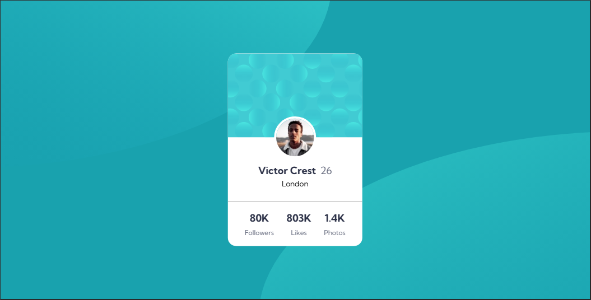
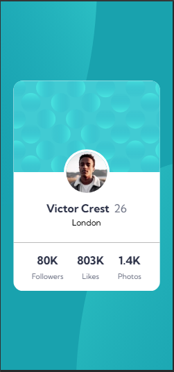

# profile-card-component-main
Profile Card Component

This is a solution to the [profile-card-component-main challenge on Frontend Mentor](https://www.frontendmentor.io/challenges/profile-card-component-cfArpWshJ). Frontend Mentor challenges help you improve your coding skills by building realistic projects. 

## Table of contents

- [Overview](#overview)
  - [Screenshot](#screenshot)
  - [Links](#links)
- [My process](#my-process)
  - [Built with](#built-with)
  - [What I learned](#what-i-learned)
  - [Continued development](#continued-development)
- [Author](#author)

## Overview

### Screenshot

These are my screenshots showing how the project turned out.

- Desktop design:



- Mobile design:



### Links

- Solution URL: [My Solution](https://gillaercio.github.io/profile-card-component-main/)

## My process

### Built with

- Semantic HTML5 markup
- CSS custom properties
- Grid Layout
- Mobile-first workflow

### What I learned

I took advantage of this project to practice the use of **background-position** and **background-size** with multiple images:

Multiple images in the background

```css
background-image: url(../images/bg-pattern-top.svg),
 url(../images/bg-pattern-bottom.svg);
  background-position: 275% 275%, -175% -175%;
  background-repeat: no-repeat, no-repeat;
  background-size: 125% 125%, 125% 125%;
  background-attachment: fixed, fixed;
```

### Continued development

I would like to improve the use of the **HTML** and **CSS**.

## Author

- Frontend Mentor - [@gillaercio](https://www.frontendmentor.io/profile/gillaercio)
- Github - [My Github](https://github.com/gillaercio)
- LinkedIn - [My LinkedIn](https://www.linkedin.com/in/gildman-la%C3%A9rcio/)